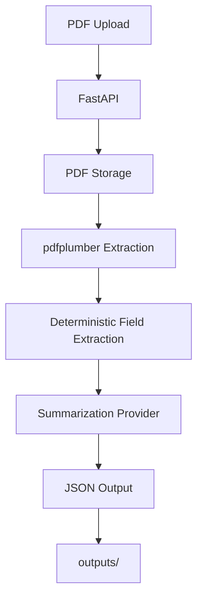

# Intelligent Insurance Document Summarizer

FastAPI MVP for extracting key fields from an insurance policy PDF and producing a readable policy summary.

This project is designed as a take-home case study: it favors a small, understandable implementation over extra infrastructure. It runs locally, uses deterministic extraction for important policy fields, and does not call paid external APIs.

## Project Overview

The API accepts one PDF insurance document, extracts text with `pdfplumber`, parses core policy fields with regular expressions, generates a short plain-English summary through a summarization provider, and persists both the uploaded PDF and the extracted JSON result.

Extracted fields:

- `policy_number`
- `insured_name`
- `effective_date`
- `expiration_date`
- `premium`
- `coverage_limits`
- `exclusions`
- `summary`
- `summary_provider`

## Architecture Diagram



## Processing Flow

1. `POST /upload` receives a single file.
2. The API validates that the upload has a `.pdf` filename and PDF file signature.
3. The original PDF is saved to `uploads/`.
4. `pdfplumber` extracts page-level text from the PDF.
5. The request fails with `422` if no text can be extracted.
6. Regex rules extract policy fields from the normalized text.
7. A summarization provider generates a readable summary from the extracted fields. The default provider is local and does not require API keys.
8. The response is validated with Pydantic.
9. The JSON result is saved to `outputs/`.
10. The latest successful response is also written to `sample_output.json`.

## Setup Instructions

```bash
python -m venv venv
source venv/bin/activate
pip install -r requirements.txt
```

## Run The API

```bash
uvicorn main:app --reload
```

Interactive docs:

```text
http://127.0.0.1:8000/docs
```

Health check:

```bash
curl http://127.0.0.1:8000/health
```

## API Endpoint Documentation

### `GET /health`

Returns a basic service status.

Sample response:

```json
{
  "status": "ok"
}
```

### `POST /upload`

Accepts one PDF file using multipart form data.

Example:

```bash
curl -X POST \
  -F "file=@Sample Policy Document.pdf;type=application/pdf" \
  http://127.0.0.1:8000/upload
```

Success response fields:

- `filename`: original uploaded filename
- `upload_path`: saved PDF path relative to the project root
- `output_path`: saved JSON result path relative to the project root
- `policy_number`: extracted policy number, if found
- `insured_name`: extracted insured name, if found
- `effective_date`: extracted policy/effective date, if found
- `expiration_date`: extracted expiration date, if found
- `premium`: extracted premium interval and amount, if found
- `coverage_limits`: extracted coverage-related limits
- `exclusions`: extracted exclusion or limiting-provision snippets
- `summary`: readable generated summary
- `summary_provider`: provider used to generate the summary, currently `local`

Error responses:

- `400`: upload is not a PDF or does not have a valid PDF signature
- `422`: PDF has no extractable text
- `500`: unexpected processing failure

## Sample Response

The repository includes `sample_output.json`, generated from `Sample Policy Document.pdf`.

```json
{
  "filename": "Sample Policy Document.pdf",
  "upload_path": "uploads/20260528T000000Z_Sample_Policy_Document.pdf",
  "output_path": "outputs/20260528T000000Z_Sample_Policy_Document.json",
  "policy_number": "VF99999990",
  "insured_name": "LELAND STANFORD",
  "effective_date": "MAY 1, 2008",
  "expiration_date": "MAY 1, 2068",
  "premium": {
    "interval": "MONTHLY",
    "amount": "$36.00"
  },
  "coverage_limits": [
    "Face amount: $500,000",
    "Coverage to age 95"
  ],
  "exclusions": [
    "Termination: This policy will terminate and, except for the limited right to reinstate the policy, all rights of the owner will end upon the earliest of the following events:; • The death of the Insured; • The Expiration Date, as shown in the Policy Specifications; • Conversion of this policy, as provided in the Conversion provision; • Lapse of this policy, as provided in the Grace Period and Lapse provision; • Successful contest of this policy as described in the Incontestability provision; and; • Our receipt of your Written Request to terminate the policy.; Upon termination we will refund to you the pro-rata portion of any premium you have paid that applies to a period beyond the end of the policy month in which the policy terminates.",
    "Suicide Exclusion: If the Insured dies by suicide, while sane or insane, within two years of the Policy Date, the Death Benefit Proceeds will be limited to an amount equal to the sum of the premiums paid. If this policy has been reinstated and the Insured dies by suicide, while sane or insane, within two years of the latest reinstatement date, the Death Benefit Proceeds will be limited to an amount equal to the sum of the premiums paid since such date."
  ],
  "summary": "LELAND STANFORD is covered by policy VF99999990, effective MAY 1, 2008 and expiring MAY 1, 2068. The monthly premium is $36.00. Key coverage limits include Face amount: $500,000; Coverage to age 95. Potential exclusions or limiting provisions include Termination: This policy will terminate and, except for the limited right to reinstate the policy, all rights of the owner will end upon the earliest of the following events:; • The death of the Insured; • The Expiration Date, as shown in the Policy Specifications; • Conversion of this policy, as provided in the Conversion provision; • Lapse of this policy, as provided in the Grace Period and Lapse provision; • Successful contest of this policy as described in the Incontestability provision; and; • Our receipt of your Written Request to terminate the policy.; Upon termination we will refund to you the pro-rata portion of any premium you have paid that applies to a period beyond the end of the policy month in which the policy terminates; Suicide Exclusion: If the Insured dies by suicide, while sane or insane, within two years of the Policy Date, the Death Benefit Proceeds will be limited to an amount equal to the sum of the premiums paid. If this policy has been reinstated and the Insured dies by suicide, while sane or insane, within two years of the latest reinstatement date, the Death Benefit Proceeds will be limited to an amount equal to the sum of the premiums paid since such date.",
  "summary_provider": "local"
}
```

Timestamps in saved paths vary by upload time.

## Test Instructions

Run unit tests:

```bash
pytest
```

Run a smoke test with the included sample PDF:

```bash
python - <<'PY'
from fastapi.testclient import TestClient
from main import app

client = TestClient(app)

health = client.get("/health")
print(health.status_code, health.json())

with open("Sample Policy Document.pdf", "rb") as pdf:
    response = client.post(
        "/upload",
        files={"file": ("Sample Policy Document.pdf", pdf, "application/pdf")},
    )

print(response.status_code)
print(response.json())
PY
```

## Design Rationale

- `main.py` remains the FastAPI entry point so the application is easy to run and review.
- `extractor.py` contains PDF text extraction and deterministic parsing, keeping business logic separate from API routing.
- `summarizer.py` defines a small provider interface so local, OpenAI, or Anthropic summarization can be swapped without changing extraction logic.
- Pydantic response models make the API contract explicit.
- Regex extraction is used for fields where exact values matter, such as policy number, dates, premium, and face amount.
- Summary generation is local and deterministic to avoid external API cost, latency, credentials, and nondeterminism.
- Uploaded PDFs and JSON outputs are persisted for traceability during review and debugging.

## Summarization Providers

The implemented provider is `LocalSummarizer`, selected by default with:

```bash
SUMMARIZER_PROVIDER=local
```

No API key is required to run the project.

To add OpenAI later, create an `OpenAISummarizer` class in `summarizer.py` with the same `summarize(fields, document_text)` method, read `OPENAI_API_KEY` from the environment, and return a concise user-facing summary from the model response. The API should continue using deterministic `fields` for structured values and pass those fields plus selected document text to the model for prose only.

To add Anthropic later, create an `AnthropicSummarizer` class with the same method, read `ANTHROPIC_API_KEY` from the environment, and register it in `get_summarizer()`. As with OpenAI, keep policy numbers, dates, premiums, coverage limits, and exclusions sourced from regex extraction rather than relying on the model for exact structured data.

## Limitations

- Works best with digitally generated PDFs that contain selectable text.
- Scanned image-only PDFs will return `422` unless OCR is added.
- Regex rules are tailored to common policy wording and the provided sample document.
- Exclusion extraction returns relevant limiting-provision snippets, not a complete legal analysis.
- The only implemented summarization provider is local; OpenAI and Anthropic are documented extension points.
- The app stores files locally and does not include authentication, authorization, or encryption at rest.

## Future Improvements

- Add OCR fallback for scanned PDFs.
- Add unit tests for each extraction rule.
- Add structured confidence scores and source page references.
- Support multiple insurance carriers and policy formats with parser profiles.
- Implement OpenAI and Anthropic summarizer providers behind the existing provider interface.
- Store outputs in durable object storage or a database for production use.
- Add request IDs, structured logging, and file retention policies.
